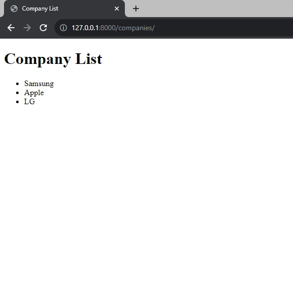
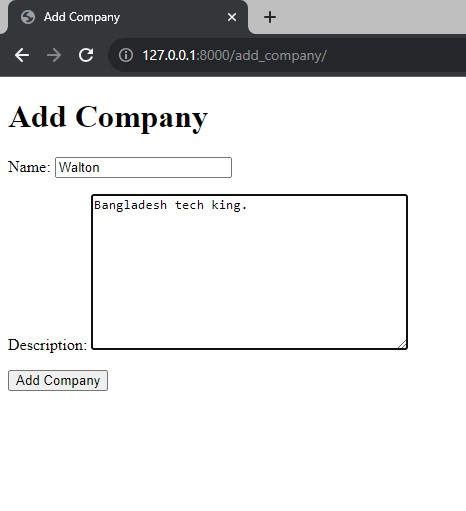
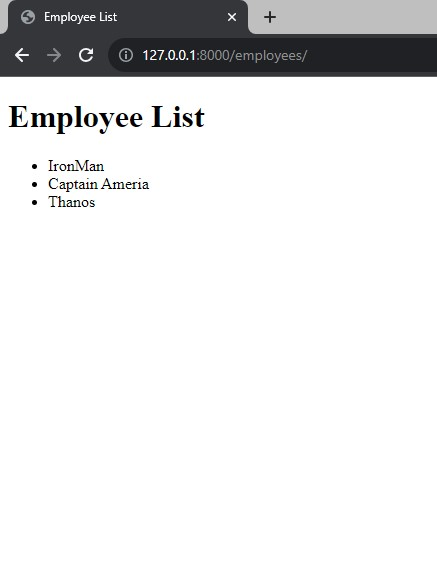
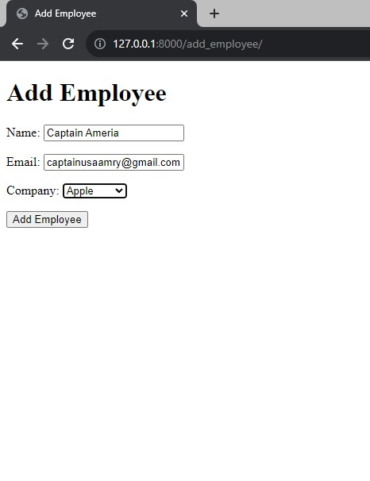
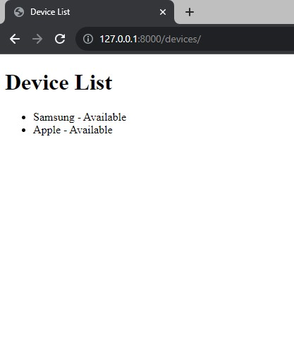
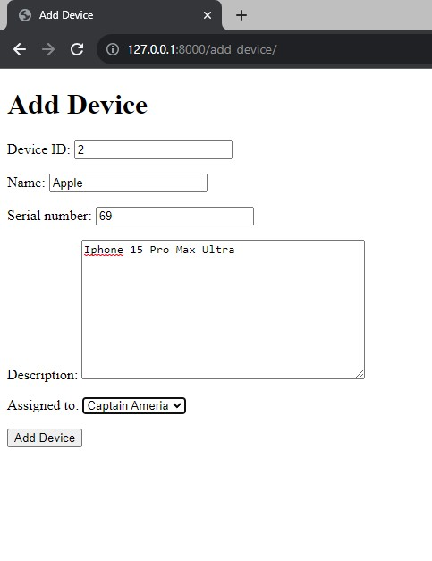
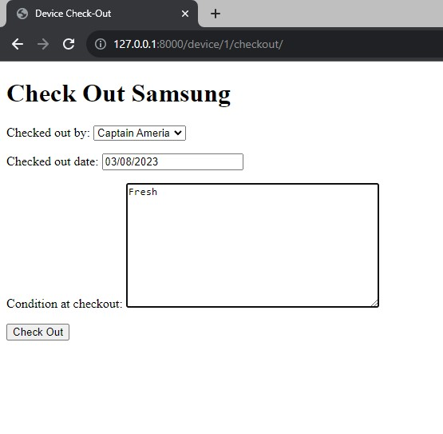
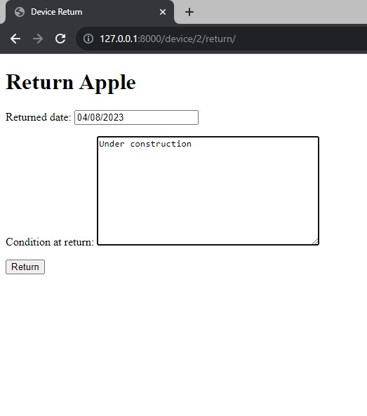
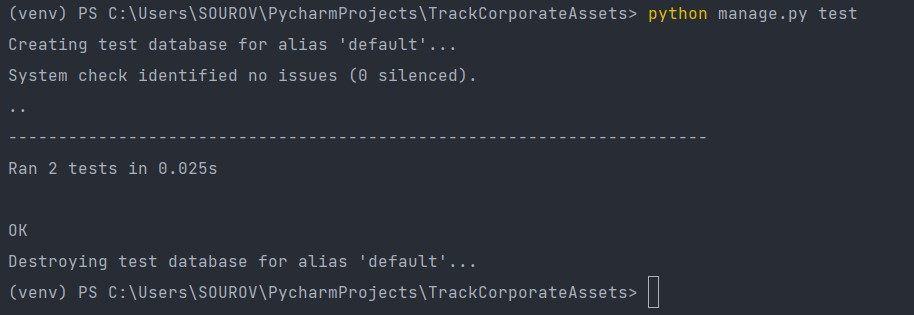
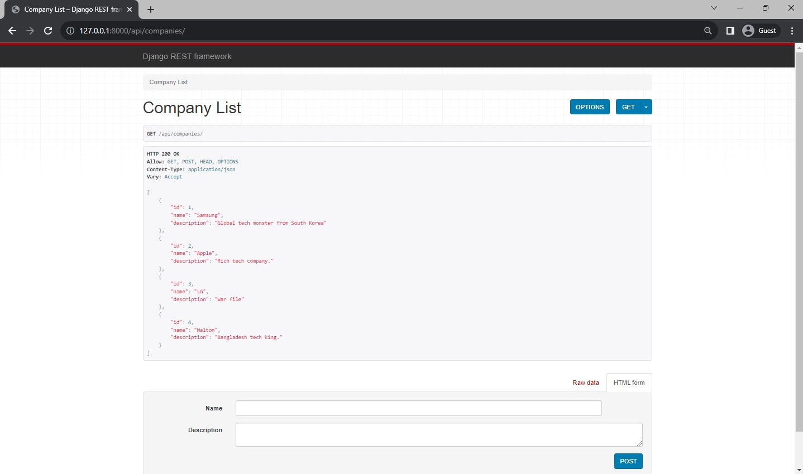

# Track Coprporate Assets

This is aDjango app to track corporate assets such as phones, tablets, laptops and other gears handed out to employees.


## Installation

Install my-project with django

```bash
  django-admin startproject TrackCorporateAssets
  cd TrackCorporateAssets
  python manage.py startapp assets
```
    


## Version
Python 3.7

Django 3.2
## Demo

All important images


## Screenshots











## Running Tests

To run tests, run the following command

```bash
  python manage.py test
```



### How to Test API?

- Companies: /api/companies/ (GET: list all companies, POST: create a new company)
- Company Detail: /api/companies/<id>/ (GET: retrieve a specific company, PUT: update a specific company, DELETE: delete a specific company)
- Employees: /api/employees/ (GET: list all employees, POST: create a new employee)
- Employee Detail: /api/employees/<id>/ (GET: retrieve a specific employee, PUT: update a specific employee, DELETE: delete a specific employee)
- Devices: /api/devices/ (GET: list all devices, POST: create a new device)
- Device Detail: /api/devices/<id>/ (GET: retrieve a specific device, PUT: update a specific device, DELETE: delete a specific device)
- Device Logs: /api/device-logs/ (GET: list all device logs, POST: create a new device log)
- Device Log Detail: /api/device-logs/<id>/ (GET: retrieve a specific device log, PUT: update a specific device log, DELETE: delete a specific device log)


## License

[MIT](https://choosealicense.com/licenses/mit/)
## 🔗 Links
[](https://www.linkedin.com/in/sourovsarkerbd/)
[](https://twitter.com/SOUROVSARKER4)


